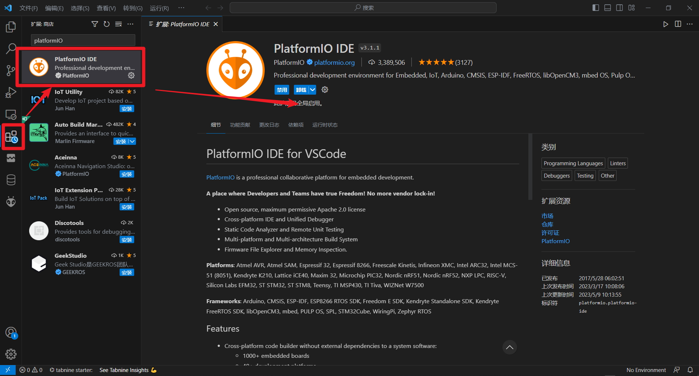
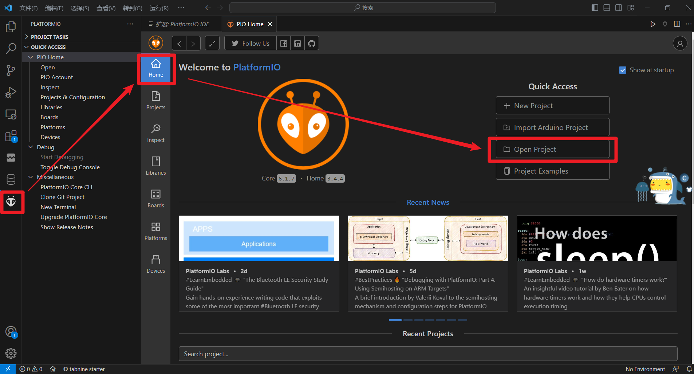
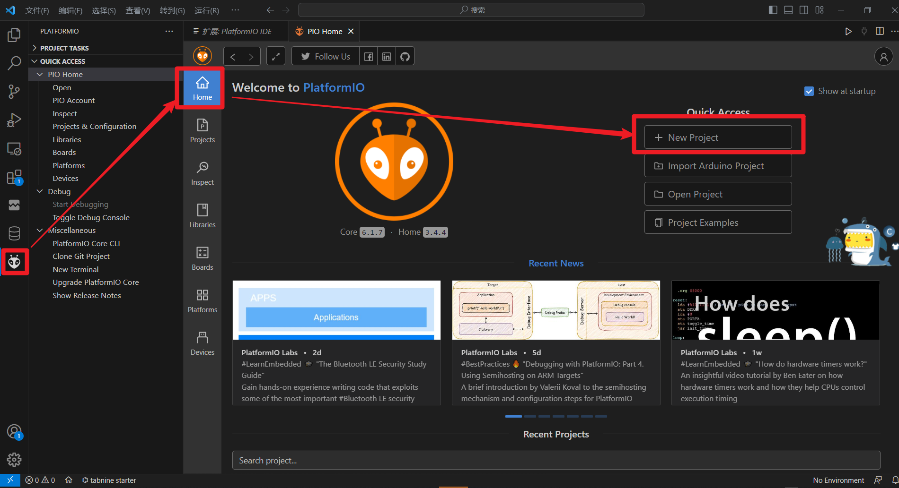
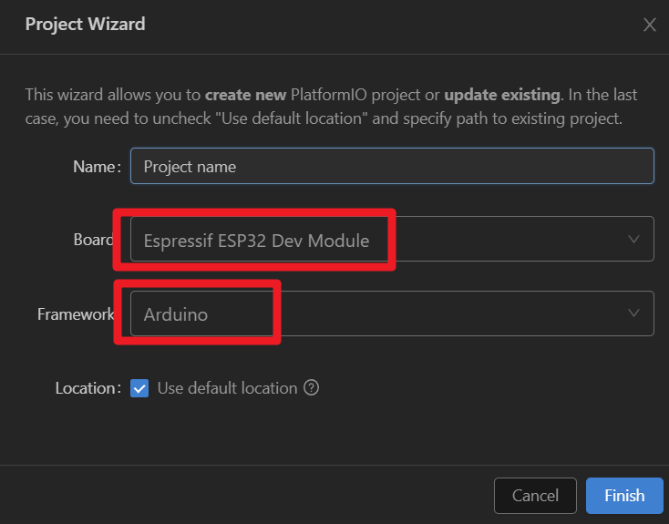
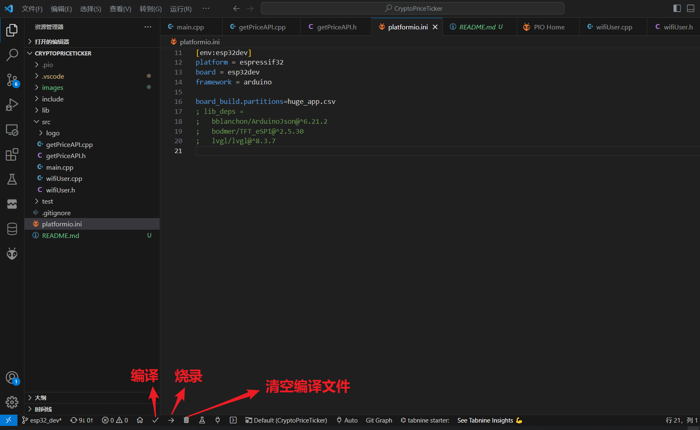
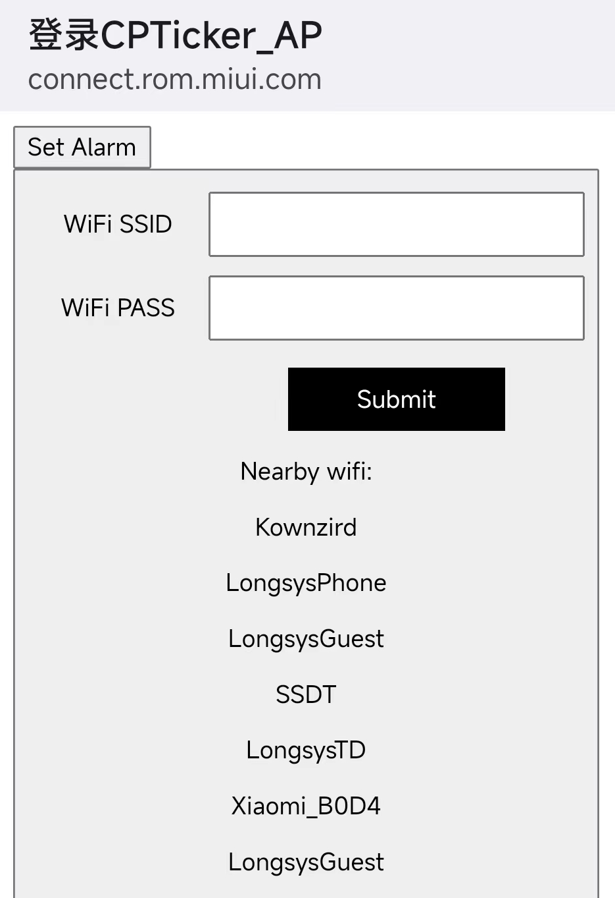
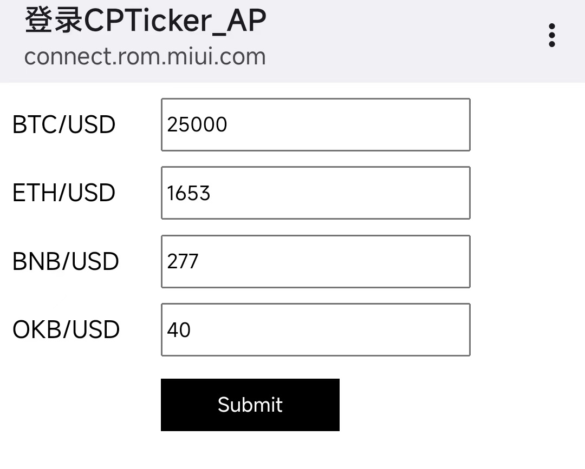
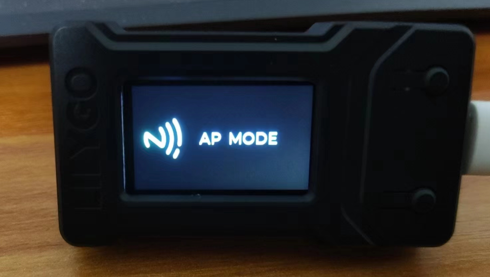
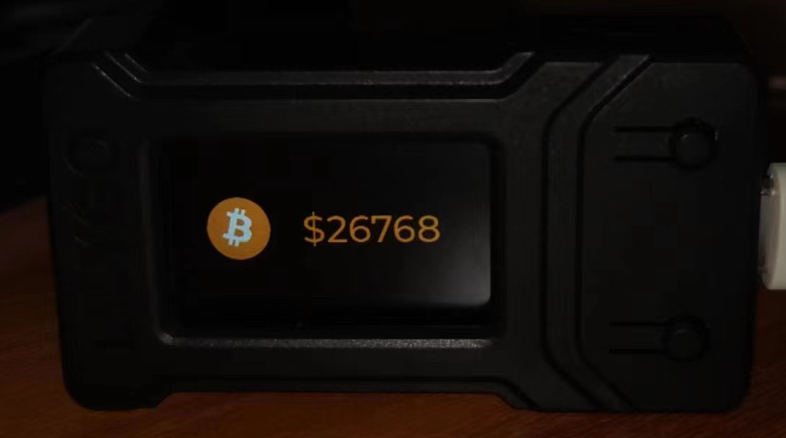

## CPTicker加密货币报价工具操作指导

作者：Kownzird

---

---
### 1、项目概述

本项目是基于ESP32 Arduino框架的加密货币报价工具，硬件使用的是TTGO T-Display，是一款搭载了Wifi及蓝牙模块和1.14英寸LCD显示屏的开发板，在软件上可实现加密货币价格查询，多币种切换，Wifi信息自动保存及邮件预警功能。


### 2、环境搭建

#### 2.1 开发环境

* VSCode
* PlatformIO IDE
* ESP32-ttgo开发板

#### 2.2 搭建步骤

* 安装好开发环境VCode

* 在`扩展程序`内搜索栏搜索`PlatformIO IDE`插件，安装插件

  

  

* 打开工程，`点击图标`，`家目录`，`打开工程`，选中本项目打开即可

  

  

* 若需要重新创建工程，则`点击图标`，`家目录`，`新项目`,配置项目名等信息

  

  

* 打开工程后，在底栏有`编译`，`烧录`，`清空编译文件`选项，点击编译后插上USB线连接上开发板即可烧录

  


### 3、功能介绍

TTGO引脚映射图如下：


#### 3.1 复位

按下`按键RST`，即可重启系统


#### 3.2 WIFI连接

初始状态下系统内没有历史WIFI账户及密码信息，此时会触发开启AP热点模式，同时开启Web服务器。

使用手机打开无线模式搜索名为`CPTicker_AP`的热点，输入密码连接

 

连接完成跳转WIFI信息配置页面，或者浏览器输入`http://192.168.4.1`，输入wifi账户密码信息点击提交即可连接，成功连接后可保存


#### 3.3 WIFI重连

系统会自动对网络连接状态进行检测，当检测到网络异常时，会优先查询保存的历史WIFI账户密码尝试连接，连接失败后会重新开启AP热点模式，提示用户重新手机配网


#### 3.4 WIFI重置

系统支持清空所有历史WIFI信息，长按`按键KEY0`(GPIO0) 8秒，即可触发WIFI信息清除，同时进行系统复位重启


#### 3.5 价格显示

网络成功连接后，系统会自动获取加密货币价格，显示屏上会显示当前的币种及对应的价格，默认初始币种为BTC


#### 3.6 币种切换

本项目可支持4种加密货币的价格查询，分别为BTC/ETH/BNB/OKB

需要切换币种时，按下KEY35（GPIO35位置）即可完成切换，切换顺序按照上述币种列表


#### 3.7 邮件预警

系统支持设置预警价格，当检测到当前查询的价格低于预警值时，可以通过邮件通知价格信息

设置预警价格时，长按`按键KEY0` 1秒，即可触发AP热点模式，手机连接上WIFI名为`CPTicker_AP`的热点，即可弹出设置页面，点击`Set Alarm`按钮切换预警设置页面

 

初始默认的预警价格为0 ，重新设置输入目标预警价格，点击提交后系统自动重连网络，重新执行价格显示功能

当当前价格低于设置值，即可发送邮件，发送邮件提示的币种信息与当前切换的币种模式有关


### 4、API

**API**使用方式

创建APIkey流程：

- 注册OKLink账户
- 登录OKLink，点击个人中心->API->链上数据->创建API
- 将创建的APIKey添加到RequestHeader上的Ok-Access-Key参数，访问RestAPI接口。

API请求地址URL如下：

- https://www.oklink.com/

APIkey使用方法：

- 对于每个API请求，需要在Http Request Headers 中添加(“Ok-Access-Key”,填写您的专属APIkey)

  

**查询代币列表信息**

* HTTP请求

  ```shell
  GET /api/v5/explorer/token/token-list
  ```

* 请求参数

  | 参数名               | 类型   | 是否必须 | 描述                                                         |
  | :------------------- | :----- | :------- | :----------------------------------------------------------- |
  | chainShortName       | String | 是       | 公链缩写符号，例如：btc、eth，请求/api/v5/explorer/blockchain/summary接口查询OKLink已支持的公链 |
  | protocolType         | String | 否       | 合约协议类型 20代币：token_20 721代币：token_721 1155代币：token_1155 10代币：token_10 默认是token_20 |
  | tokenContractAddress | String | 否       | 代币合约地址                                                 |
  | page                 | String | 否       | 页码                                                         |
  | limit                | String | 否       | 返回条数，默认返回最近的20条，最多50条                       |

* 返回参数

  | 参数名                 | 类型   | 描述                      |
  | :--------------------- | :----- | :------------------------ |
  | page                   | String | 当前页码                  |
  | limit                  | String | 当前页共多少条数据        |
  | totalPage              | String | 总共多少页                |
  | chainFullName          | String | 公链全称，例如：`Bitcoin` |
  | chainShortName         | String | 公链缩写符号，例如：`BTC` |
  | tokenList              | Array  | 代币列表                  |
  | > tokenFullName        | String | 代币名字全称：`USDCoin`   |
  | > token                | String | 代币名字简称：`USDC`      |
  | > precision            | String | 精度                      |
  | > tokenContractAddress | String | 代币合约地址              |
  | > protocolType         | String | 代币合约协议类型          |
  | > addressCount         | String | 持币地址数                |
  | > totalSupply          | String | 最大供应量                |
  | > circulatingSupply    | String | 流通量                    |
  | > price                | String | 价格，`USD`为单位         |
  | > website              | String | 官方网站                  |
  | > totalMarketCap       | String | 总市值                    |
  | > issueDate            | String | 代币发行日期              |


### 5、其他

成品展示：





